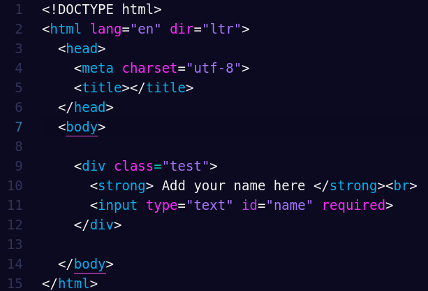

# Sweet Synthwave syntax theme for [Atom](https://atom.io)

> Sweet Synthwave is a Syntax theme based on Outrun color scheme for sublime text and Pink Pansy syntax theme for Atom.



## **How to install**

### Install using Atom Package Manager
```
apm install sweet-synthwave-syntax
```
### Install using Git
You can install the theme and keep up to date by cloning the repo directly into your ~/.atom/packages directory.
```
git clone https://github.com/stephkeys/sweet-synthwave-syntax.git ~/.atom/packages/sweet-synthwave-syntax
```
### Install manually
Download using the [GitHub .zip download](https://github.com/stephkeys/sweet-synthwave-syntax/archive/master.zip) option and unzip them  

Move the *sweet-synthwave-syntax* folder to  *~/.atom/packages*

### Activating theme

Go to *Atom -&gt; Preferences*, click in the *Themes* tab, and select *Sweet Synthwave* in the *Syntax Theme* dropdown.
